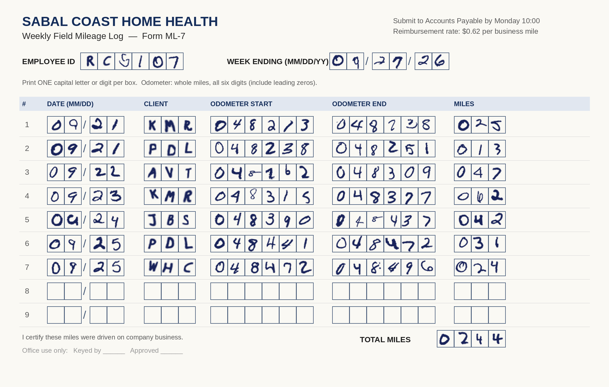
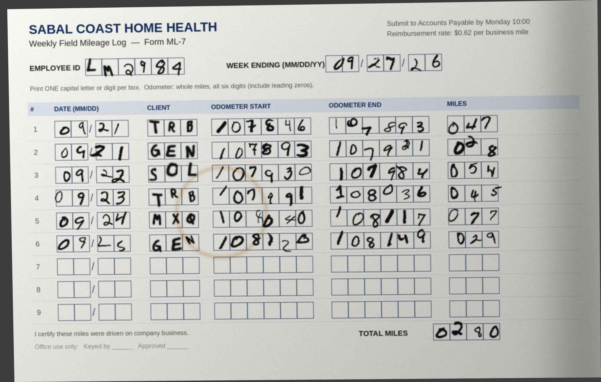
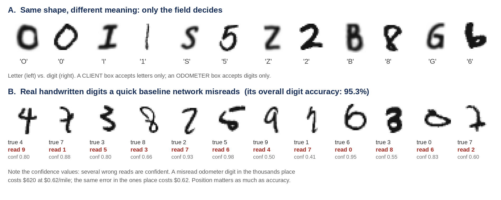
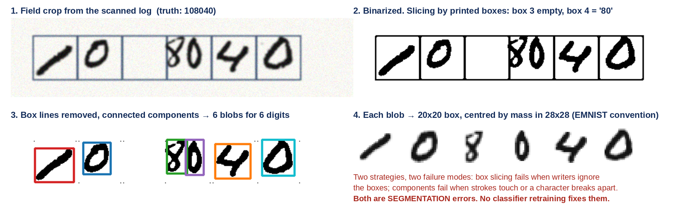
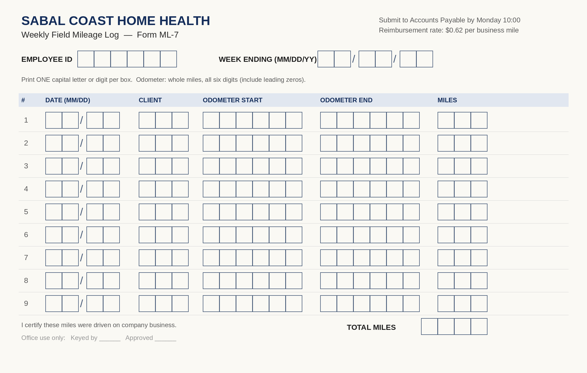

# Reading the Road Log: ISM 6642 Final Project Overview

This overview records the project requirements, business case, specifications, grading criteria, and figures for the two-week prototype.

## Project at a glance

- **Format:** preassigned groups of 3, 4, or 5
- **Duration:** two weeks
- **Weight:** 10% of the course grade plus 4% of Mid-Term Exam 2
- **Week 1:** team setup, approach, plan, and spike
- **Week 2:** implementation, measurement, and demonstration

## 1. What the project is assessing

The goal is not to solve handwriting recognition completely in two weeks. The project assesses whether the team can:

- Understand data workflows and execution pipelines.
- Implement a neural network on real data.
- Train models on real-world datasets used by businesses.
- Evaluate machine-learning business implications in dollar terms.
- Work coherently as a team using Scrum, sprint workbooks, clear roles, and coordination.
- Make progress on training, testing, and validating a neural network with real business consequences.

### Required project outcomes

1. **Approach:** a design document that decomposes the problem into a pipeline, explains decisions at each stage, and gives the reasons for those decisions.
2. **Live demonstration:** a rough but working end-to-end run on a real image of a mileage log. It must run live; a slide deck or voice-over video is not a substitute for the live demonstration.
3. **Honest measurements:** accuracy measured under stated conditions, with failure modes named. The team should get as far as possible, avoid overclaiming, and not be stressed about hitting a particular accuracy number.

A reproducible result with a clear explanation of its limitations is more valuable than a high number that cannot be reproduced on a new image. The team must build its reader pipeline itself; see Section 6.

## 2. Business problem

Sabal Coast Home Health employs about 2,300 field clinicians—nurses, therapists, and home-health aides—who drive their own cars between patient homes across eleven Florida counties. Clinicians record each trip on a handwritten Weekly Field Mileage Log (Form ML-7), usually in the car between visits. They photograph the paper form with a phone and email it to Accounts Payable (AP). Two mobile-app pilots failed to gain adoption, so the company continues to use paper.

Six AP clerks key about 10,000 logs per month, or roughly 70,000 trip rows, into the ERP. Keying costs about $3.40 per log—about $408,000 per year—and reimbursements can be delayed by two weeks. That delay is clinicians' leading complaint in exit interviews.

The CFO wants to know whether a model can read the log, validate its fields, and schedule reimbursements without a clerk. The prototype must make clear that a misread has a business cost and that different errors have different consequences:

- **Overpayment:** a thousands-place odometer error adds 1,000 miles, or $620 at $0.62 per mile. The same error in the ones place adds $0.62. Under an IRS accountable plan, an unsupported reimbursement may become taxable wages, creating payroll-tax and audit consequences.
- **Underpayment:** the clinician may file a correction ticket, costing about $28 to resolve, and lose confidence in the process.
- **Wrong employee or client:** payment can go to the wrong person or miles can be charged to the wrong patient cost center, creating an audit finding.

At 70,000 rows per month, a 2% row-level error rate would mean 1,400 incorrect reimbursements each month. The design question is therefore which reads can be posted automatically and which must go to a clerk—not merely the highest attainable accuracy.

The form provides internal checks: each row has written miles, there is a total, and the odometer should move forward. These checks can identify model errors and mistakes made by the clinician.

### 2.1 Form ML-7 field specification

| Field | Characters | Allowed | Business rule |
|---|---:|---|---|
| Employee ID | 6 (2 letters + 4 digits) | A–Z, 0–9 | Must exist in the HR master list |
| Week ending | 6 (MM DD YY) | 0–9 | Valid date, Sunday, within the last 60 days |
| Trip date | 4 (MM DD) | 0–9 | Must fall inside the stated week |
| Client code | 3 | A–Z | Must appear on the clinician's visit schedule for that date |
| Odometer start / end | 6 each | 0–9 | End > start; start ≥ previous row's end |
| Miles | 3 | 0–9 | Must equal end − start |
| Total miles | 4 | 0–9 | Must equal the sum of the MILES column |

### 2.2 Sample forms

The brief's examples were created by placing isolated EMNIST-style character images in Form ML-7 boxes. Figure 1 is a clean scan; Figure 2 represents typical phone-photo conditions.

#### Figure 1: clean Form ML-7

Row 5 is intentionally inconsistent: the clinician wrote 42 miles, but 048437 − 048390 = 47. The written total (244) agrees with the written MILES column, not the odometer differences (249). The system must identify and route this inconsistency.

| Row | Date | Client | Odometer start | Odometer end | Miles written | End − start |
|---:|---|---|---:|---:|---:|---:|
| 1 | 09 21 | KMR | 048213 | 048238 | 025 | 25 |
| 2 | 09 21 | PDL | 048238 | 048251 | 013 | 13 |
| 3 | 09 22 | AVT | 048262 | 048309 | 047 | 47 |
| 4 | 09 23 | KMR | 048315 | 048377 | 062 | 62 |
| 5 | 09 24 | JBS | 048390 | 048437 | 042 | 47 |
| 6 | 09 25 | PDL | 048441 | 048472 | 031 | 31 |
| 7 | 09 25 | WHC | 048472 | 048496 | 024 | 24 |

Ground truth: employee ID RC5107; week ending 09/27/26; total written miles 0244.

#### Figure 2: phone photo under field conditions

This sample has perspective skew, uneven light, a shadow at the right edge, a coffee ring, JPEG compression, a different pen, and messier writing. In row 3, the last odometer digits spill over box lines; in row 5, two digits crowd across a box border. Ground-truth employee ID: LM2984; total miles: 0280.

## 3. Setup sprint and team working modalities

Week 1 is planning and risk reduction; no modeling is expected. The team should produce a plan it can execute and test the riskiest assumption early.

| Timing | Work | Output |
|---|---|---|
| Mid-Term 2 (Week 6 / Week 7) | Form team, assign roles, set up a two-week sprint workbook, and plan the spike. | Team contract, sprint plan, and related setup work (about ½ page) |

### The spike

A spike is a small throwaway experiment that tests the riskiest assumption before the team commits a week to a plan built on it. Possible questions include:

- **Can the system find the boxes?** Deskew a skewed phone photo, detect the printed box lines, and cut out the cells. Does an odometer field yield exactly six cells? How many of 20 photos work?
- **Does field restriction help?** Train a quick ByClass classifier. Compare digit accuracy across all 62 classes with accuracy when output is limited to the ten digits.
- **Will EMNIST read the cells?** Try raw crops, including box-line fragments, with a clean-EMNIST model; then improve preprocessing and try again.
- **How often do checks catch an error?** Corrupt one random digit in 1,000 synthetic rows and measure how often mileage, continuity, and total checks flag it.

The spike is judged on whether it changed the plan, not whether it succeeded. The ideal report states the assumption, test, result, and resulting plan change.

### EMNIST details to handle

- Images are stored transposed relative to the MNIST convention. Fix this in the loader and add an assertion.
- ByClass preserves natural class frequencies: digits greatly outnumber letters, and English letter frequencies are uneven. Employee-ID letters and client codes are closer to uniform. Decide how to handle this imbalance.
- Handwritten look-alikes include O/0, I/1, S/5, Z/2, and B/8. ByClass also distinguishes lowercase and uppercase forms such as c/C, o/O, and s/S. Use the known field type and uppercase-only rule to decide whether to restrict outputs, train separate models, or use Balanced or ByMerge data.
- EMNIST characters are isolated, centered, and white on black. Form cells contain dark ink on light paper, may be off-center, and include box-line fragments. Preprocessing must bridge this difference.

Figure 3 illustrates why an overall accuracy number is insufficient: look-alikes need field context, and some incorrect quick-network predictions are confident.

### Approach document (3–4 pages)

| Section | Required coverage |
|---|---|
| Problem framing | Sabal Coast's need and the cost of a misread by field and digit position |
| Pipeline | Diagram and paragraph per stage: registration, extraction, normalization, classification, field assembly, validation, then post or route |
| Data | Source, class handling, imbalance and look-alike decisions, and how the test set gets known ground truth |
| Modeling | First model to try and why; fallback if it fails |
| Evaluation | Metrics and conditions to report |
| Spike | What was tested, what was found, and what changed |
| Scope | What Week 2 will build and what it will not attempt |
| Risks | Top three risks and mitigations |

State assumptions explicitly—for example, that the full form is visible and rotation is under 10 degrees—and name unsupported cases such as crossed-out corrections. A clear scope is part of the deliverable.

## 4. Execution sprint

| Epic | Focus |
|---:|---|
| 1 | Train the character classifier and report held-out digit and letter results separately. |
| 2 | Register the form and extract cells: photo in, one crop per box out. |
| 3 | Integrate end to end: first a complete log read, then validation rules. |
| 4 | Measure, decide auto-post versus clerk review, build the demo interface, and prepare a fallback recording. |
| 5 | Present. |

### Integration traps

1. **Training and inference preprocessing must match.** If training uses center-of-mass placement in a 20×20 box within a 28×28 image with white ink on black, inference must apply the same steps. Mismatch is a common reason for strong validation results but unusable form reads.
2. **Segmentation and recognition failures are different.** Finding five cells in a six-digit field or combining two digits in one crop is an extraction error, not a recognition error. Count each separately.
3. **Validation rules are not model accuracy.** Report raw recognition accuracy separately from the residual error among rows allowed to auto-post.

Figure 4 shows a writer ignoring the boxes: one box is empty and another contains “80.” Fixed slicing by printed boxes fails here. Removing box lines and using connected components can recover the digits, but may fail when strokes touch. The normalization must match the training images.

## 5. Accuracy expectations

| Metric | Expectation |
|---|---|
| Character accuracy on the team's test set | ≥80% is a reasonable prototype goal. Report digit and letter accuracy separately, whatever the result. |
| Field-level accuracy | No threshold. Report by field; it will be lower than per-character accuracy. At 95% per character, a six-character field is fully correct only about 74% of the time. |
| Cell-extraction success | Report separately from recognition. |
| Straight-through rate and residual error | Report the share of rows auto-posted and their error rate; this is the CFO's key measure. |
| Conditions | State image quality for every number: clean scan, phone photo, blur, skew, and similar conditions. |

An accuracy below 80% is not a project failure if the team can explain it. A failure is reporting an unreproducible number or one that cannot be reproduced live.

Build a labeled test set. One option is to generate valid logs, place EMNIST test-split characters into a form image, and save the known labels. Never use a character from the training split in test logs. Also fill out blank forms by hand with made-up data and photograph them; volunteer handwriting is the most honest test.

## 6. Build it yourself

Build the data loader, form registration and cell extraction, training loop, normalization, validation rules, demo interface, evaluation harness, and synthetic log generator. Standard libraries such as NumPy, pandas, PyTorch, TensorFlow, scikit-learn, OpenCV, PIL, Streamlit, Gradio, and Flask are permitted. A neural-network convolution layer is allowed; using a finished form-reading repository is not.

The project reader may not use Tesseract, EasyOCR, PaddleOCR, TrOCR, Donut, another pretrained OCR/document model from Hugging Face, a cloud document-reading service (AWS Textract, Google Document AI, Azure AI Document Intelligence), or an LLM/vision-language model to read the image. Such tools may be run as a comparison if clearly identified; they cannot be the project reader.

AI assistants are permitted and expected. Disclose their use in a short appendix. The team owns every submitted line and should be able to explain the code during the demo.

## 7. Roles

| Role | Owns |
|---|---|
| Data | EMNIST loading, class and look-alike handling, synthetic log generator, and test set |
| Model | Training, evaluation, error analysis, and confusion analysis |
| Pipeline | Registration, cell extraction, normalization, field assembly, and validation |
| Demo | Interface, live demonstration, and fallback recording |
| Business | Cost model by field and digit position, auto-post policy, recommendation, and roadmap |

Teams of three or four should share Business work between two members rather than omit it.

## 8. Live demonstration (10 minutes + 5 minutes Q&A)

| Time | Section | What to show |
|---:|---|---|
| 1 min | Recommendation | Lead with what you would tell the CFO. |
| 3 min | Approach | Explain the pipeline and defend two or three key decisions. |
| 3 min | Live run | Load a log photo the class has not seen; show the stages, read, checks, and each row's post-or-route decision. Deliberately show a failure. |
| 2 min | Numbers and limits | State measurements, conditions, and failure modes. |
| 1 min | Four more weeks | Give a concrete, prioritized roadmap. |

Requirements:

- The demo must accept a log supplied at demo time. The instructor may bring generated or hand-filled logs using Appendix A. Provide a file-path or upload input.
- Show a failure on purpose as well as successful cases.
- Record a backup video in case the live demo fails. The video is a fallback, not a replacement for the live demo.
- Be ready to explain the training code, learning rate, model layers, train/validation/test sizes and class distributions, and why the model cannot output lowercase letters.

## 9. Deliverables

- Approach document, 3–4 pages, due at the end of Week 2.
- Git repository runnable from a clean clone; README states the one command to run the demo.
- Results summary, 2 pages: metrics, conditions, confusion analysis, and failure modes.
- Business note, 1 page: auto-post versus clerk-review policy and approximate monthly cost at 10,000 logs (70,000 rows), compared with today's $3.40 per log.
- Live 10-minute demonstration and backup recording.
- Individual contribution statement, ½ page per person, submitted privately.

## 10. Grading (100 points)

| Component | Points | Full-credit standard |
|---|---:|---|
| Approach document | 30 | Pipeline is correctly decomposed; decisions are justified; scope and risks are explicit. |
| Spike quality | 10 | A genuinely risky assumption was tested cheaply and the result changed the plan. |
| Working prototype | 20 | End-to-end run works on an unseen demo-time log; code is the team's work; repo runs from a clean clone. |
| Measurement | 5 | Conditions accompany metrics; segmentation and recognition are separate; raw accuracy and post-rule error are both reported; failures are named; claims are reproducible. |
| Presentation + demo: business | 15 | Team understands field- and digit-position-dependent error costs and auto-post thresholds. |
| Presentation + demo: communication | 15 | Recommendation leads; CFO can follow it; limitations are stated plainly. |

### Deductions

- Repo does not run from a clean clone: −8.
- Accuracy is reported without conditions: −5.
- Demo only works on preselected images: −5.
- Off-the-shelf OCR, document model, or LLM is used as the reader: −20.

The course weights thinking at 40 points, building at 25 points, and presenting at 35 points. In a two-week project, reasoning quality is a fairer signal than artifact quality.

## 11. Hard constraint: synthetic or made-up data only

Do not use real mileage logs, expense reports, or reimbursement forms—not from an employer, a friend, or online. Real logs may contain names, employee IDs, and home addresses; home-health trip details can identify patients and qualify as protected health information under HIPAA. Client codes stand in for patients for this reason. Use programmatically generated logs or forms filled by the team with made-up data. Submitting real reimbursement documents earns zero on the project.

## 12. References

- Cohen, G., Afshar, S., Tapson, J., & van Schaik, A. (2017). “EMNIST: an extension of MNIST to handwritten letters.” arXiv:1702.05373.
- LeCun, Y., Bottou, L., Bengio, Y., & Haffner, P. (1998). “Gradient-based learning applied to document recognition.” *Proceedings of the IEEE*, 86(11), 2278–2324.
- Plamondon, R., & Srihari, S. N. (2000). “On-line and off-line handwriting recognition: A comprehensive survey.” *IEEE Transactions on Pattern Analysis and Machine Intelligence*, 22(1), 63–84.

## Appendix A. Blank Form ML-7

The instructor may use this form during the demonstration. For the team's own handwriting tests, print it, fill it with made-up trips, and photograph it.

