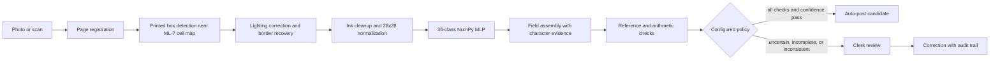

# Approach for a handwritten mileage claim reader

This prototype asks a narrow CFO question: which rows can be read and
reconciled with enough evidence to avoid a clerk, and which rows must wait for
human review? Our prototype reads the supplied ML-7 mileage form, checks the extracted information and identifies rows that need a clerk. Our recommendation is to keep human approval for reimbursements. The team's recorded handwriting test read no complete trip row correctly, so the project demonstrates a working pipeline and its limits rather than a system ready to issue payments.

## Problem framing

Sabal Coast processes about 10,000 logs and 70,000 trip rows each month.
At $3.40 per log, current keying is about $34,000 per month ($408,000 per
year). A 2% row error rate would leave about 1,400 wrong rows a month. A
wrong odometer digit can change the reimbursement by very different amounts:
one place in a six-digit odometer represents $62,000, $6,200, $620, $62,
$6.20, or $0.62 per mile-value change. The brief's example of a thousands
place error is $620. Underpayment may generate a roughly $28 correction
ticket, while an incorrect employee or client code creates a traceability and
audit problem. Raw character accuracy alone is therefore not an approval
rule.

The system retains recognized values and checks them rather than silently
repairing them. Field restrictions reduce predictable character ambiguity:
employee-ID positions 1–2 and client boxes accept A–Z; date, odometer, miles,
and total boxes accept 0–9. The field hint resolves cross-group look-alikes
such as O/0 and I/1, but it cannot resolve two permitted characters that
look similar within a single letter-only or digit-only field.

## Pipeline

**Registration.** OpenCV searches for a page-shaped quadrilateral, corrects
perspective, and warps it to the dimensions of the blank form included in the
brief. A flatbed image with matching page proportions has an aspect-ratio
fallback. ORB feature matches to the supplied blank template then correct
printing offsets, subject to inlier, spatial coverage and geometry checks.
This uses printed layout features, not a pretrained text reader. A page whose
template alignment cannot be verified carries a review reason even when its
paper boundary is accepted. The first spike is limited to synthetic blank
forms with controlled rotation, perspective, and shadow.

**Cell extraction and normalization.** A versioned coordinate map names each
character position on the 2200 × 1400 template. Local thresholding and line
detection locate the actual printed box groups near those coordinates. Crops
are inset from the detected borders; near-identical boxes retain the canonical
coordinates. Isolated specks and tiny thin border fragments are removed without
discarding substantial handwriting connected to an edge. Dark pixels become
white ink on black; the glyph is fit within a
20 × 20 area and centered by its mass in a 28 × 28 frame. The same transform
is applied to EMNIST train, validation, and test characters. The original model
weights and default ink threshold remain in use. Unverified borders and handwriting
touching a crop boundary are retained as review warnings with each character.

For a readable cell with verified borders, border recovery tests a smaller
inset (2 pixels instead of 5), staying inside the same printed box. Long frame
lines are removed only from the newly exposed margin, and only ink connected
to the original cleaned character is retained. At least five new ink pixels
must be recovered; candidates that lose original ink or become too dark are
rejected. Blank, unreadable and unverified boxes keep their original crops.
Crop selection uses image pixels, without classifier confidence or ground
truth. Applied recoveries always carry a review warning. Result JSON retains
the printed frame (`source_rect`), actual crop bounds (`crop_rect`), original
crop bounds and recovered-pixel counts (`border_recovery`). Saved crop images
show the raw expanded source, before line removal and normalization.

Cell lighting correction estimates the paper background with a 21 × 21
morphological closing and divides out smooth illumination changes. It runs
only inside verified boxes with measurable faint ink or darker/uneven paper.
Strong ink uses the default relative threshold of 165; faint ink uses 185.
Changes smaller than five pixels or 3% of the original ink are ignored.
Excessively dark backgrounds, dense candidate masks and small pale specks
do not qualify. The EMNIST checkpoint and 20 × 20/28 × 28 normalization remain
unchanged. Any applied adjustment adds a review warning and a
`lighting_adjustment` record containing the background measurements, threshold
and changed-pixel count. Source crop images remain unmodified. The frozen
comparison raised team-form character accuracy from 54.1% to 69.5%, with
no exact trip rows; the generated synthetic test score slipped from 97.34%
to 97.25%. These tradeoffs are reported in `docs/results_summary.md`.

**Classification and assembly.** The model is a one-hidden-layer NumPy MLP
(784 input values, ReLU hidden layer, 36 output classes). It is trained from
scratch on ByClass digits and capital letters, with lowercase classes
removed and inverse-frequency loss weights. Every cell returns a predicted
character, its restricted probability, and alternatives. Each field retains
its raw read, position-wise evidence, and minimum character confidence. A
date's ISO normalization is stored separately from its raw digits.

**Validation and routing.** Synthetic HR and visit-schedule records validate
employee IDs and date-specific client codes. Date checks cover the stated
Monday–Sunday week; a week-ending date must be a Sunday no more than 60 days
old. Odometer end must exceed start, starts must not move backward, written
miles must equal the odometer difference, and weekly total must match the
written mileage column. Reimbursement is calculated at $0.62 per written
mile. Every failed check is retained. The configured policy also requires
character-confidence thresholds, with a higher threshold for the three
highest odometer places. Only a row that passes both evidence and business
checks is an auto-post candidate. Unverified template alignment, failed cell
extraction and crop warnings also block automatic routing, including when the
model gives a high probability. Reviewers can see the source crop and warning;
an explicit correction remains marked as reviewed.

**Review and correction.** The CLI accepts new file paths. A clerk can submit
`--correction rows.5.miles=047 --reason "..."`; the original prediction,
corrected value, reason, source cell crops, and recalculated check result go
to an append-only JSONL file. A corrected row remains marked as reviewed; it
does not become an unreviewed automatic post. The browser interface accepts
local image uploads and camera photos from a phone connected to the laptop's
local network. It shows page registration, field values, cell crops,
confidence, validation checks, and row routing. The CLI remains available as
a fallback.

## Data and model choices

The source is EMNIST ByClass. The loader checks the NIST mapping and repairs
the transposed orientation. The 36 permitted labels are digits 0–9 followed
by capital letters A–Z. Training uses the ByClass distribution with
inverse-frequency weighting; inference restricts probabilities to each box's
allowed character group. The clean EMNIST source is not itself a realistic
phone-photo dataset, so synthetic test logs place held-out EMNIST test
characters into the boxes and vary capture quality. Exact image duplicates
shared with train or validation are excluded from generated logs.

A separate pre-rendered QA pack in `examples/synthetic_forms/` contains five
underlying valid forms with three image conditions each, plus three
deliberately invalid controls. Its ground truth and expected failed checks
support fixture and demo use. The pack is scored separately by
`scripts/evaluate_synthetic_forms.py`; it is not the 15-log generated set used
for the generated-log metrics. Keep each form's image variants grouped in
evaluation.

The first model is intentionally a small, explainable baseline: 784 inputs,
192 ReLU hidden units, 36 logits, cross-entropy, Adam-style updates, learning
rate 0.001, batch size 256, ten epochs by default. The training command
records actual hyperparameters, split sizes, class counts, digit and letter
scores, and a confusion matrix. If the model does not transfer to cells, the
fallback is to route those rows to a clerk and improve cell preprocessing or
collect more made-up handwriting; no prohibited OCR or document model is
used as the reader.

## Measurement plan

The training report separates unrestricted 36-class accuracy from
field-restricted accuracy and reports digits and letters separately. The
synthetic-log report measures exact field and row accuracy, cell extraction
failures, recognition failures, the share of rows and logs that pass routing,
and the error rate among auto-posted rows. Use EMNIST validation characters to
create separate synthetic development logs for iteration; reserve test-split
logs for held-out synthetic evaluation. The pre-rendered fixture pack has a
separate report for read accuracy by condition and expected-check detection.
Its variants are paired views of five forms, so they are not independent
samples. These synthetic evaluations describe only controlled conditions and
generated handwriting. The three new hand-filled forms guided preprocessing.
The twelve team-filled forms were manually labeled and evaluated separately
after settling each preprocessing version. Since they have been evaluated
repeatedly, they now serve as a comparison benchmark. New forms from
different writers are needed to check generalization of the frozen reader.

The current `ml7-cell-lighting-v3` reader is frozen as of 2026-10-06;
`docs/version_freeze.md` records its code revision and model/configuration
hashes. Evaluate new forms with those artifacts and report raw predictions
before any corrections. Future changes require an explicit decision to start
a new version. If a batch guides those changes, reserve another unseen batch
for the new version's evaluation.

The SCRUM-12 spike tests registration and printed box geometry only; it does
not imply handwriting accuracy. The report is generated by
`scripts/run_spike.py` and gives per-condition registration and box-grid
results. The reader routes a crop failure separately from a low-confidence
or incorrect character prediction.

## Scope and risks

The MVP supports the supplied ML-7 geometry, photos where the page boundary
can be recovered, up to nine rows, and the explicit synthetic reference set.
It does not recognize cross-outs, handwriting that spills through several
box boundaries, arbitrary form revisions, authentic employee schedules,
payroll or ERP posting, production identity controls, or real reimbursement
documents. Blank and unsupported fields go to review.

| Risk | Mitigation |
|---|---|
| Page corners or grid lines are missed under glare, cropping, or severe skew | Measure conditions in the spike; reject unregistered images and retain the reason |
| Clean isolated EMNIST characters do not represent handwriting in photographed boxes | Keep the 12-form handwritten evaluation separate from synthetic results; improve extraction and occupied-row detection; expand to more writers and capture conditions |
| A confident character error has a position-dependent dollar cost | Use arithmetic/reference checks, a higher threshold for high odometer places, and a conservative row route; do not claim calibrated confidence |
| Preprocessing choices fit a few writers or repeated evaluation results | Keep v3 frozen; measure new writers before choosing further changes; report characters, fields and rows separately |

## AI assistance disclosure

OpenAI Codex assisted with implementation scaffolding, code edits, development
labels, border and lighting recovery, evaluation analysis and draft project
documentation, as detailed in `docs/ai_assistance.md`. The team remains responsible for understanding,
reviewing, explaining, and presenting every part of the submitted work.
